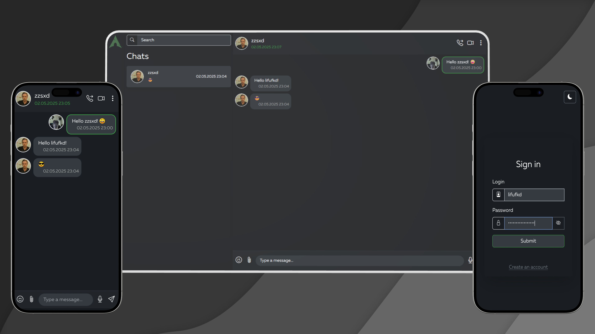

# 💬 ChatWave Web
[🇷🇺 Русский](./README/README.ru.md) | [🇬🇧 English](./README.md)

**ChatWave Web** — это современный,быстрый и безопасный веб-фронтенд для мессенджера **ChatWave**, реализованный на JavaScript.  
Простой интерфейс, мощные функции и гибкая настройка — всё, что нужно для общения в 2025 году. 🚀



---

## 🌐 Возможности

### 📝 Регистрация

- **Никнейм** — минимум **3 символа**
- **Логин** — минимум **3 символа**
- **Пароль** — минимум **8 символов**, обязательна:
  - одна **прописная латинская** буква,
  - одна **строчная латинская** буква,
  - одна **цифра**

### 🔐 Вход

- **Логин**
- **Пароль**

### 🏠 Главная страница

- 📥 Получение списка **личных чатов**
- 🔍 **Поиск пользователей** (валидация: минимум 3 символа)
- ➕ Создание **личных диалогов**
- 👤 Просмотр и **редактирование своего профиля**:
  - Аватар
  - Никнейм
  - Логин
  - Личная информация (БИО)
  - День рождения
  - Дата/время последнего онлайна
  - Дата/время создания аккаунта
  - Дата/время последнего обновления
- 🧑‍💼 Просмотр **чужих профилей**
- 🧹 Очистка чатов
- 🚪 Выход из чатов
- ❌ Удаление аккаунта

### 💬 Чат

- 💌 Отображение сообщений:
  - Контент (текст, фото, голос)
  - Аватар отправителя
  - Никнейм
  - Дата и время отправки
- ✍️ **Отправка**:
  - Текстовых сообщений
  - Фотографий
  - Фото с подписью
  - Голосовых сообщений
- 🔄 **Получение** сообщений от собеседника
- 🗑️ **Удаление** сообщений (своих и собеседника)
- 🖊️ **Редактирование** своих сообщений (только текст)

---

## ⚙️ Установка

### 🔧 Вариант 1: Ручная установка

1. Клонируйте репозиторий:
   ```
   git clone https://github.com/lifufkd/chatwave-web.git
   cd chatwave-web
   ```
2. Настройте конфигурацию в js/config.js:
   ```
   export const API_BASE_URL = "http://127.0.0.1:8000"; // адрес бэкенда
   export const API_TOKEN_LIFESPAN = 1209500;
   export const LONG_POLLING_DELAY = 1; // интервал long-polling запросов
   export const DEFAULT_MESSAGES_QUANTITY = 20;
   ```
3. Запустите локальный сервер (например, с помощью Live Server или другого dev-сервера)

### 🐳 Вариант 2: Docker
1. Скачайте готовый образ:
```
docker pull ghcr.io/lifufkd/chatwave-web:latest
```
2. Запустите с нужными переменными окружения:
```
docker run -d \
  -e API_URL=http://backend-host \
  -e API_PORT=8000 \
  -e JWT_ACCESS_TOKEN_EXPIRES=1209500 \
  -e LONG_POLLING_DELAY=1 \
  -e DEFAULT_MESSAGES_QUANTITY=20 \
  -p 8080:80 \
  ghcr.io/lifufkd/chatwave-web:latest
```
